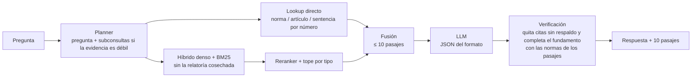

# RMSE — Hackathon 2026

**Integrantes:** Andrés Chaparro, Camilo Sánchez, Lucas Mejía  
**Universidad de los Andes**

**Video (máximo 5 minutos):** [video_equipo_RMSE.mp4](https://drive.google.com/file/d/139aIzyvGjN_JUcSLMlCOBWCPHSBqWwQD/view?usp=sharing)

Sistema de respuesta a preguntas de derecho colombiano con un modelo abierto de
tamaño reducido (Llama-3.1-8B-Instruct) y un corpus jurídico propio de 29.137
documentos: 473 normas y sentencias seleccionadas frente al banco y la relatoría
completa de la Corte Constitucional (28.664 sentencias C, T y SU de 1992 a 2026).

## Corpus e índice

<!-- OBLIGATORIO. El jurado descarga desde aquí. Verificar el enlace desde una
     sesión privada del navegador antes de las 15:00. -->

| Recurso | Enlace | Tamaño | Licencia |
|---|---|---|---|
| Corpus procesado e índice vectorial | https://drive.google.com/file/d/1yXC8VouANIeYCUJ93qOZdo8HxmjmX3II/view?usp=sharing | 5,6 GB | CC-BY-4.0 |

El comprimido contiene `LICENSE`, `corpus_manifest.json`, `corpus/` con los
documentos procesados e `indice/` con el índice serializado y los fragmentos.

El enlace permanece activo hasta el **2 de noviembre de 2026** (treinta días después del evento).

Bitácora del corpus (inventario, criterio de selección, método y evolución del
puntaje): [`CORPUS.md`](CORPUS.md). Manifiesto: [`corpus_manifest.json`](corpus_manifest.json).

## Arquitectura

| Componente | Elección | Motivo |
|---|---|---|
| Encoder | `BAAI/bge-m3` (1.024 dimensiones, búsqueda exacta) | Benchmark de cinco encoders sobre un índice de 66.291 fragmentos (`eval/RESULTADOS_ENCODERS.md`). Denso solo: body-hit@10 0,90, igual que `snowflake-arctic-embed-l-v2` y por encima de `jina-embeddings-v3` (0,88) y `multilingual-e5-large` (0,85). Con BM25, lookup y reranker ninguno lo supera de forma pareja: `Qwen3-Embedding-4B` (0,95 solo) da el mismo pipeline y tarda 33 min en indexar frente a 2,5-9 min; jina sube el body-hit del pipeline (0,95) pero baja el article-hit (0,53 frente a 0,58) |
| Decoder | `meta-llama/Llama-3.1-8B-Instruct`, cuantizado q4 en Ollama, temperatura 0 | Mejor de cinco decoders abiertos de ≤ 8B en las mismas condiciones del sábado: 59,03/80 frente a 54,89 Ministral-8B, 54,80 Qwen3-8B, 48,95 Salamandra-7B y 38,05 Granite 4.2 (`eval/benchmark_decoders/RESULTADOS.md`) |
| Segmentación | Leyes por artículo (partes de ≤ 2.000 caracteres), sentencias por sección más una ficha (ponente, fecha, lo que resolvió); cada fragmento empieza con el nombre citable de su norma | El evaluador solo reconoce el respaldo si la cita aparece en el texto de los 10 pasajes |
| Recuperación | Lookup directo de normas, artículos y sentencias nombrados en la pregunta + híbrido denso y BM25 (`bm25s`, Snowball español) fusionado con RRF. La relatoría cosechada, la Resolución 368 de 2014 y una compilación de reseñas de la Corte Suprema solo entran cuando la pregunta las nombra | Con la relatoría en la búsqueda general, el 97 % de los fragmentos son sentencias y desplazan a la norma (52,40 frente a 58,62 sobre la muestra); la resolución, nombrada, ocupaba los 10 pasajes y desplazaba el CPACA de referencia; la compilación bajaba RAGAS de la muestra (media de 14,42 frente a 15,20 sin ella) |
| Reordenamiento | `BAAI/bge-reranker-v2-m3` sobre 40 candidatos, con tope por tipo de documento (≤ 3 sentencias en los 10, ≤ 6 si la pregunta pide jurisprudencia) | Mismo body-hit y recall que rerankers 2 a 6 veces más lentos (Qwen3-Reranker 0,6B y 4B, bge-reranker-v2-gemma), que solo suben el article-hit de 0,58 a 0,63 (`eval/RESULTADOS_RERANKERS.md`) |
| Mecanismo de abstención | Cerradas nunca se abstienen. Texto libre se abstiene sin pasajes o si el LLM no encuentra respuesta en ellos; las citas sin respaldo se eliminan sin volver a llamar al LLM | La abstención vale 0,5 y una cita sin respaldo resta el doble de un acierto |

Un solo pipeline con etapas intercambiables. `configs/baseline.yaml` y
`configs/agentic.yaml` (sobre `configs/base.yaml`) eligen qué implementación usa
cada etapa; el agéntico, que es el de la entrega, es el baseline más un
re-planeo con subconsultas cuando la evidencia es débil, no código aparte.



| Etapa | Módulo |
|---|---|
| Planner | `src/planning/` — `passthrough.py` (baseline), `subqueries.py` (agéntico) |
| Lookup directo | `src/retrieval/lookup.py` (usa `scripts/citations.py`, sin LLM) |
| Híbrido | `src/retrieval/hybrid.py` sobre `dense.py` y `bm25.py`; máscara de la relatoría en `relatoria.py` |
| Reranker y tope por tipo | `src/retrieval/rerank.py`, `cuotas.py` |
| Fusión | `src/retrieval/fusion.py` |
| Generación | `src/generation/answer.py` + `llm.py` (Ollama, temperatura 0, guided JSON; carga el modelo antes de la primera llamada) |
| Verificación | `src/verification/verifier.py` + `citations.py`; fundamento desde los pasajes en `src/generation/respaldo.py`; topes de oraciones y palabras en `src/generation/answer.py` (la extensión mínima de `src/generation/extension.py` está apagada) |
| Abstención | `src/verification/abstention.py` |
| Composición y bucle | `src/pipelines/baseline.py`, `agentic.py`, `registry.py` |
| Contratos y trazas | `src/common/types.py`, `timing.py`; cada pregunta deja su traza en `traces.jsonl` |

Todo es determinista: temperatura 0, semilla fija y desempates estables. Regenerar
una pregunta suelta (`python -m src.main --config configs/agentic.yaml --split test --ids 123`)
reproduce las mismas normas citadas y los mismos pasajes.

## Estructura del repositorio

| Ruta | Contenido |
|---|---|
| `data/`, `schema/`, `scripts/` | Material oficial del kit, sin modificar |
| `docs/` | Contratos entre módulos (`CONTRATOS.md`) e inventario de fuentes del equipo (`inventario_fuentes_corpus.xlsx`, insumo de `src/ingest/importar_inventario.py`) |
| `sources/` | Qué se descarga y de dónde (`*.yaml`, `urls.lock.json`, `relatoria_cc_urls.md`) |
| `configs/` | `base.yaml` + `baseline.yaml` / `agentic.yaml`; tabla de alias de normas |
| `src/` | Offline: `ingest` → `index`. En línea: `planning` → `retrieval` → `generation` → `verification`, compuestos en `pipelines`; `submission`, `api` |
| `interfaz/` | Interfaz gráfica |
| `eval/` | Techo de recuperación, barridos y benchmarks; `runs/`: registro de todas las corridas (`README.md`), resultados de los benchmarks y las corridas de la entrega (`2026-10-03_sample_final2`, `2026-10-03_test_992_final`) |
| `informe/` | Informe técnico (PDF y fuente) |
| `tools/` | Restauración del corpus publicado (`restaurar_corpus.py`), anexo de `CORPUS.md` desde el manifiesto, informe a PDF, enlace del corpus y medición del LLM |
| `corpus/` | Artefactos pesados (no versionados; se publican en la nube) |

## Reproducción

Probado en Windows 11 con Git Bash, Python 3.13.2, una NVIDIA RTX 4090 (24 GB, CUDA 12.8),
64 GB de RAM y Ollama 0.12.6. En Linux los comandos son los mismos (el entorno se activa con
`source .venv/bin/activate`). No se incluye imagen de contenedor: el entorno se fija con
`requirements-lock.txt`.

**1. Requisitos**

| | |
|---|---|
| GPU | NVIDIA con ≥ 16 GB de VRAM y driver compatible con CUDA 12.8 (decoder, encoder y reranker comparten la GPU) |
| RAM | ≥ 32 GB (probado con 64 GB) |
| Disco | ~30 GB: zip del corpus (5,6 GB), corpus e índice restaurados (~13 GB) y modelos (~10 GB) |
| Software | Python 3.13, Git, Bash (en Windows, Git Bash) y [Ollama](https://ollama.com) ≥ 0.12 |

**2. Entorno de Python**

```bash
python -m venv .venv
source .venv/Scripts/activate        # Linux: source .venv/bin/activate
pip install -r requirements-lock.txt # versiones exactas de la entrega (o requirements.txt)
```

El encoder (`BAAI/bge-m3`) y el reranker (`BAAI/bge-reranker-v2-m3`) se descargan de Hugging
Face la primera vez que corre el sistema.

**3. Decoder**

```bash
ollama serve &                       # si Ollama no corre ya como servicio (la app de Windows lo arranca sola)
ollama pull llama3.1:8b              # debe responder en http://localhost:11434
```

**4. Corpus e índice.** Descargar `corpus_RMSE.zip` (5,6 GB; el enlace de la sección *Corpus e
índice*, o directo por consola con `confirm=t`, que salta el aviso de Drive para archivos grandes)
y restaurarlo (deja `corpus/processed/` y `corpus/index/` y verifica la huella del índice):

```bash
curl -L -o corpus_RMSE.zip "https://drive.usercontent.google.com/download?id=1yXC8VouANIeYCUJ93qOZdo8HxmjmX3II&export=download&confirm=t"
python tools/restaurar_corpus.py corpus_RMSE.zip
```

Para reconstruirlo desde las URL declaradas en lugar de descargarlo: `CORPUS.md`, sección 3
(el índice denso tarda ~65 minutos en una RTX 4090).

**5. Comando único**

```bash
bash run.sh sample     # 50 preguntas de muestra: responde, valida y evalúa (sin RAGAS)
bash run.sh test       # 992 preguntas: requiere data/test_992.jsonl (lo entrega el jurado)
```

Cada corrida queda en `eval/runs/<fecha>_agentic/` (`submission.jsonl`, `traces.jsonl`,
`validacion.json` y, en la muestra, `report.json`). Si `python` no es el del entorno:
`PYTHON=.venv/Scripts/python.exe bash run.sh sample`.

**6. RAGAS (opcional).** El juez de texto libre usa un entorno aparte y la llave de
OpenRouter en `scripts/.env` (ver `.env.example`):

```bash
python -m venv .venv-eval
.venv-eval/Scripts/pip install -r scripts/requirements-evaluador.txt
.venv-eval/Scripts/python scripts/evaluate.py --submission eval/runs/<corrida>/submission.jsonl --split sample --ragas
```

**7. Regenerar preguntas sueltas** (verificación en vivo): con temperatura 0, semilla fija y el
índice congelado, la salida coincide con `submissions.jsonl` en normas, pasajes y redacción.

```bash
python -m src.main --config configs/agentic.yaml --split test --ids 20 887 892
```

Tiempo estimado sobre las 50 preguntas de muestra: ~3 minutos (3,5 s por pregunta), más
~2 minutos de carga del índice y del modelo (hasta 3 minutos en frío). Las 992 del test: ~60 minutos.

## Resultados sobre las preguntas de muestra

Evaluador oficial sobre las 50 preguntas de muestra; son las cifras del informe técnico
(`informe/INFORME_TECNICO.pdf`), medidas el 02-10 con la extensión mínima activa (registro en
`eval/runs/README.md`):

| Componente | Puntos | Posibles |
|---|---:|---:|
| Exactitud en cerradas (12 de 15) | 16,00 | 20 |
| Calidad de citación (recall 0,918; 0 citas sin respaldo) | 18,37 | 20 |
| Abstención calibrada | 9,30 | 10 |
| **Total automático sin RAGAS** | **43,67** | **50** |
| Corrección RAGAS (media de dos juicios: 0,461) | 13,82 | 30 |
| **Total automático con RAGAS** | **57,49** | **80** |

El informe se redactó antes de un último cambio: el jurado aclaró que solo rige el máximo de
palabras (150 en semiabiertas, 500 en abiertas; lo que pase se corta), así que la extensión
mínima con texto literal quedó apagada y el código solo acota las semiabiertas a 5 oraciones y
150 palabras. Con esa configuración, que es la de la entrega, y el corpus final
(`eval/runs/2026-10-03_sample_final2/`), el componente determinista es el mismo (43,67) y RAGAS
sube a 15,20 (media de dos juicios: 0,507): 58,87/80 en total. La evolución completa está en
`CORPUS.md` (sección 4) y en `eval/runs/README.md`.

La entrega del test es `submissions.jsonl` (raíz), copia de la corrida
`eval/runs/2026-10-03_test_992_final/`; sus trazas se conservan para la verificación en vivo.

## Interfaz gráfica

Cómo ejecutarla:

```bash
python -m src.api --config configs/agentic.yaml --port 8000
# abrir http://127.0.0.1:8000/
```

Permite formular una pregunta en cualquiera de los tres formatos y muestra la respuesta,
las normas citadas (respaldadas o no) y los 10 pasajes recuperados con las citas
resaltadas, con la identidad visual de Software Colombia. Detalles en `interfaz/README.md`.

## Limitaciones conocidas

1. **Conclusiones erradas con la evidencia correcta.** En varias preguntas la norma
   pertinente está entre los 10 pasajes y el modelo de 8B concluye lo contrario (ítems 563 y
   879 de la muestra) o calcula mal (cuantía en salarios mínimos, ítem 528). Pedirle
   razonar antes de responder no lo corrigió.
2. **Casos narrativos largos.** En las preguntas abiertas que cuentan un caso de varios
   párrafos, el reranker (pares de hasta 512 tokens) puntúa bajo todos los pasajes: es el grueso
   de las 154 preguntas del test con evidencia débil. La respuesta se apoya entonces más en el
   modelo que en la evidencia.
3. **Jurisprudencia sin nombrar.** La relatoría completa solo entra cuando la pregunta nombra
   la sentencia; una pregunta por "el precedente sobre X" no la consulta. Una variante que la
   trae por las normas que cita está implementada pero apagada (neutral en la muestra).
4. **Artículo exacto.** En 8 de las 19 preguntas de la muestra cuya referencia nombra un
   artículo, ese artículo no llega a los 10 pasajes, aunque la norma sí.
5. **Huecos de corpus.** Faltan algunas sentencias citadas por el banco (la unificación
   2020CE-SUJ-4-005 del Consejo de Estado, la SL1972-2025 y la T-248 de 2025, que la relatoría
   no publica), y algunas preguntas nombran sentencias con un número que no existe (SU-279 de
   2019, SU-488 de 2011): el lookup no las resuelve. Detalle en `CORPUS.md`.
6. **La abstención casi no se activa.** El umbral de confianza del reranker no está calibrado;
   el sistema solo se abstiene sin pasajes o con respuesta vacía.
7. **Ruido del juez.** Sobre una misma entrega, RAGAS varió hasta 0,9 puntos y en cada juicio
   dejó al menos un ítem sin calificar (cuenta como cero); las comparaciones usan la media de
   varios juicios.
